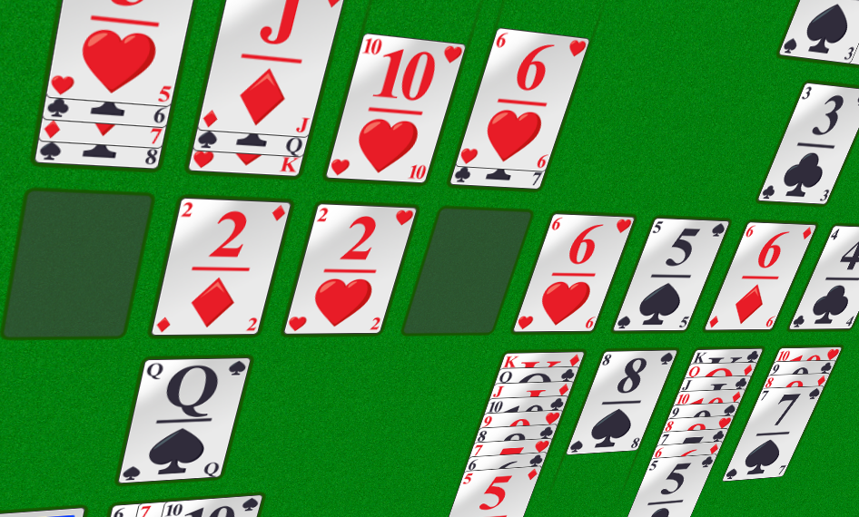
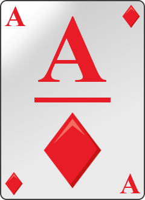
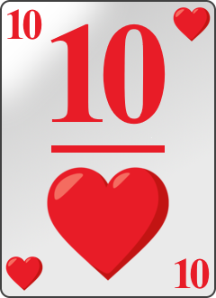

# cards2.0
A pluggable card game engine by Tim De Mey with a plugin supporting a remake of MSN Messenger's Solitaire Showdown

## Project Goal
Back in the early nillies people could play Solitaire Showdown, a game included in the chat application MSN Messenger - later renamed to Windows Live Messenger. As Microsoft pulled the plug, this game is no longer available to the public, or at least not in its original form. 

This project's goal is to replicate the original as close as possible. [This](screenshots/solshow_orig_game.jpg) is a screenshot of the original game.

The game is still unfinished as specific parts require are not yet (fully) developed. Some examples:
* Score system
* Sounds
* UI must be reworked to resemble the original game

## A pluggable card game engine

The main engine found in cards_framework must be started with a plugin in order to run a game. Currently, two plugins are supported: 
* Solitaire (single player - [screenshot](screenshots/solitaire_590x445.png?raw=true))
* Solitaire Showdown (1vs1 multiplayer - [animated GIF](screenshots/solitaireshowdown_04162020.gif?raw=true))

## Sprites

All in-game sprites were made by me. For example, all cards were made in Paint.NET, using a bunch of layers to switch between red and black colored card elements, to switch the card value, to add a gloss etc. Then, I saved 52 times to a PNG file, each time with different layers switched on and off, resulting in 52 cards in PNG format. Infact, this was the first thing done before writing any code.

The cards are designed to replicate the cards as seen in the [original Solitaire Showdown game](screenshots/solshow_orig_game.jpg).

Examples:

  

## Project History

* Around 2015 I started with cards1.0. It used vectorial cards which was slow to render. The architecture was bad. In the end, this project was abandoned and it never produced a working game.
* Development on cards2.0 started somewhere in october 2018 and was initially focused at making a standard, single player Solitaire game in order to have most of the UI stuff working, but already with Solitaire Showdown in mind.
* Starting late 2018, netcode was added, after which the work on the primary goal, Solitaire Showdown, was started. 
* After a long period of doing nothing, I continued somewhere around January 2020, refactoring the complete codebase and throwing away unnecessary garbage. When that was done, support for undoing command chains was added. (In multiplayer the server may not accept commands that are already executed client-side. They are executed client-side and corrected afterwards if necessary, to ensure a smooth gameplay that never blocks).
* The hardest part was then done. Support for lobbies was added, I completed the game logic, it all started coming together around April 2020. (see [animated GIF](screenshots/solitaireshowdown_04162020.gif?raw=true)). 

