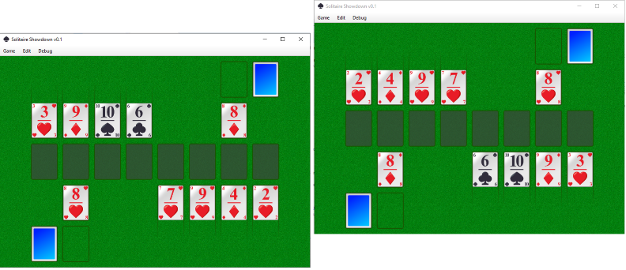
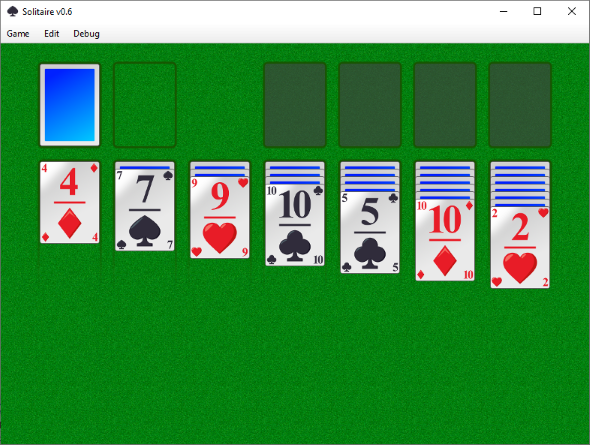

# cards2.0
Remake of MSN's Solitaire Showdown

Hi there.

I'm Tim De Mey, a software engineer developing in Java, C#, and some C++ as well.

The goal of this one-man project is to recreate MSN's Solitaire Showdown which you could play back in the days around 2000 - 2005 within the Windows Live Messenger application. It's a fun project written in Java, but with a lot of attention to detail and smooth gameplay. I once started with this 5 years ago, but the architecture was bad, it had ugly cards, I used vectorial cards and the SVG library was really slow, and in the end I just didn't continue on it. This is cards2.0, which has the same goal as the first iteration, but the remake should resemble the original game, and I'll finish it. The approach is more like "think a little, implement the idea, think again, refactor a little when needed". Only when the architecture doesn't support some feature, I'd go into refactor mode to build 
support for it. Don't waste time on improving the architecture when it won't be necessary.

Development started somewhere in october 2018 and was initially focused at making a standard, single-player Solitaire game in order to have most of the UI stuff working. Starting late 2018, that was done, and I continued with adding netcode, after which the work on the actual game, Solitaire Showdown, was started. 

At april 2020, the game looks like this but is not yet finished:

In above screenshot you see 2 players each having their own game instance running, being connected to a LAN server that one of the players is currently hosting. 

The same card game engine can be used to drive a different card game, e.g. single player solitaire:

All in-game sprites were made by me. For example, all cards were made in Paint.NET, using a bunch of layers to switch between red and black colored card elements, to switch the card value, to add a gloss etc. Then, I saved 52 times to a PNG file, each time with different layers switched on and off, resulting in 52 cards in PNG format. Infact, this was the first thing done before writing any code.

At the time of writing this README I did my first commmit which includes a working Solitaire and a partially working Solitaire Showdown. There's
still a lot of stuff that must be fixed or added, or stuff I'd really like to see in there but isn't really necessary at this moment:
- Support for concurrent card stack updates. Right now the game will go into an invalid state if both players try to manipulate the same
  stack. There is support for undo/redo, but it's the server that must control it. This is what I'm currently working on; a client-side
  rollback system controlled by the server when one of the two players is "too late".
- Decent dialogs. 
- Decent UI.
- Support for when a player leaves the game mid-game.
- Better handling client-side when the server goes down. (There is a message dialog but resources are not cleaned up, e.g. the game stays visible)
- End of game support.
- Score system.
- Configuration (e.g. remembering your name).
- Plug & play: framework detecting plugins, so an automatic discovery of games that can be played. Currently a startup parameter
  controls what game is loaded in the framework, I hope to move this into a full runtime discovery thing.
- Better sound architecture. There is support for sound effects but it is slow and sometimes there is a very noticable delay between       the game action and playing the sound.

This is the list of currently supported features:
- A framework that can support a card game implemented in a plugin.
- Fast and scalable UI. (sprites are being resized on the fly whenever the window size changes).
- Undo/redo mechanism. In a single player, a player can control this, and in a multiplayer a server could control this; because a client
  has latency on the network, it always sees an outdated state, so it is possible that a move allowed locally is not allowed on the server,
  which should thus order the client to rollback its move.
- A fully decoupled UI layer, a Client layer, and a Server layer. The UI thread is never blocked, meaning that all commands are being
  executed immediately and that the mechanism is designed in such way that an executed command is rolled back later on, if necessary.
  For example, a client will never ask the server if a move would be legal as that would be a long running operation, which is very
  unwanted in fast action game. Instead, the move is fully executed on the UI layer and the player sees what he expects to see. Then,
  in the background, that move command is rescheduled on the Client layer which is processing commands in a different thread. 
  This thread will then talk to the server, telling that the move was done client-side. The server will process the same command in 
  the Server layer, which will decide on the validity of the command. If the command is rejected, a Reject command is sent back to the
  client, arriving in its Client layer, which can then preprocess necessary actions, after which the necessary commands will be 
  executed on the UI layer which the player would also see visually (e.g. cards being moved back to original positions, a dialog telling
  that the last move was rejected, ...).
- LAN server discovery by UDP broadcasting.
- Clients are notified when the server goes down and do clean up the connections.
- Sound effects
- Plugin: Solitaire. 
- Plugin: Solitaire Showdown.

Enjoy.
