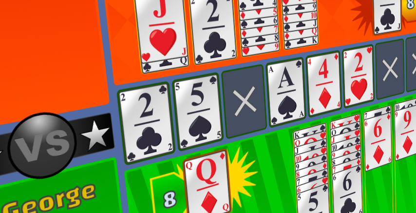
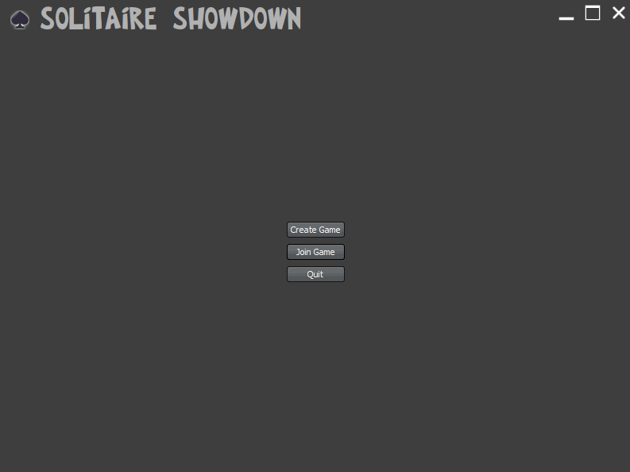

# cards2.0
A pluggable card game engine created by Tim De Mey coming with a plugin supporting a remake of MSN Messenger's Solitaire Showdown

## Project Goal
Back in the early nillies people could play Solitaire Showdown, a game included in the chat application MSN Messenger - later renamed to Windows Live Messenger. As Microsoft pulled the plug, this game is no longer available to the public, or at least not in its original form. 

This project's goal is to replicate the original as close as possible. [This](screenshots/solshow_orig_game.jpg?raw=true) is a screenshot of the original game.

The game is still unfinished as specific required parts are not yet (fully) developed. Some examples:
* Score system
* Sounds
* UI must be reworked to resemble the original game

## A pluggable card game engine

The main engine found in [cards_framework](../master/cards_framework) must be started with a [plugin](../master/cards_framework/src/main/java/src/gent/timdemey/cards/ICardPlugin.java) in order to run a game. Currently, two plugins are supported: 
* Solitaire (single player - [screenshot](screenshots/solitaire_590x445.png?raw=true) - [plugin](../master/cards_solitaire/src/main/java/src/gent/timdemey/cards/SolitairePlugin.java))
* Solitaire Showdown (1vs1 multiplayer - [animated GIF](screenshots/solitaireshowdown_11252020.gif?raw=true) - [plugin](../master/cards_solitaireshowdown/src/main/java/src/gent/timdemey/cards/SolShowPlugin.java))

## Latest animated GIF

## Project History

* Around 2015 I started with cards1.0. It used vectorial cards which was slow to render. The architecture was bad. In the end, this project was abandoned and it never produced a working game.
* Development on cards2.0 started somewhere in october 2018 and was initially focused at making a standard, single player Solitaire game in order to have most of the UI stuff working, but already with Solitaire Showdown in mind.
* Starting late 2018, netcode was added, after which the work on the primary goal, Solitaire Showdown, was started. 
* After a long period of doing nothing, I continued somewhere around January 2020, refactoring the complete codebase and throwing away unnecessary garbage. When that was done, support for undoing command chains was added. (In multiplayer the server may not accept commands that are already executed client-side. They are executed client-side and corrected afterwards if necessary, to ensure a smooth gameplay that never blocks).
* The hardest part was then done. Support for lobbies was added, I completed the game logic, it all started coming together around April 2020. (see [animated GIF 04/16/2020](screenshots/solitaireshowdown_04162020.gif?raw=true)). 
* May 2020: Better handling of leaving players, lost connections, full lobbies, general cleanup of TCP connections in all these cases. Added score system. Support for animations other than cards. Added more card sprites for both front and back, and card stacks. (see [animated GIF 05/21/2020](screenshots/solitaireshowdown_05212020.gif?raw=true))
* June 2020: The entire scalable component and scalable resource system has been reworked. Resources are now preloaded before the game is started, and scaled resources are being cached. This results in a more instant UI update when the game is rescaled and all resources are only scaled once in a particular dimension, even if they are being used by multiple components. Up to this point, only images were supported as a "scalable resource". Support was added for text: the font itself is the scalable resource here. The first use case for scalable text was added to Solitaire Showdown, and is seen in the animation that shows the increment in score, when laying down a card on a cardstack. (see [animated GIF 06/29/2020](screenshots/solitaireshowdown_06292020.gif?raw=true))
* July 2020: Support for animations spanning resizements was added, so you can resize the window while animations are ongoing. This is the last part in making the game truely resizable at any moment. A counter for the SPECIAL stack in Solitaire Showdown was added as well. Font are handled better in terms of resizing the game. ScalableTextComponents now cache their content in a BufferedImage which is useful during rescale operations, to show a temporarily low-quality scaled version of the text until the resource (a font) is loaded. Work has begun on the HUD which means that the cards, the card stacks and their related imagery/text are no longer the only components on the playfield; the first added HUD items are the player names, positioned as in the original MSN game. 
* November 2020: Summer has passed - back to work after a break of several months. Several visuals have been created. Animation trajectories are pixel perfect in all resolutions. Game is really starting to look like the original now.
* December 2020: Multiple "root" panels are now supported: "menu", "loading" and "game" panels were added. With this feature, a menu was added which will fully replace the menubar, and a loading screen can now be overlayed. Several architectural and logical fixes related to drag/animation and Z-layering of components have been implemented, making animations behave correctly. 
* January 2021: The window/frame/dialog system has been refactored. Dialogs are no longer seperate frames. The main window no longer has the default OS titlebar but a custom one, which blends better with the content panel. An in-game menu dialog has been added. For example, it allows a player to disconnect from the current game. Performance fixes have been made as in some cases the game didn't feel smooth. Shortcuts (e.g. ESC key for the in-game menu) have been implemented.
* July 2021: Another big refactoring operation has been completed. All panels can now load their components in tiny batches, to keep the UI alive, e.g. to animate a loading panel while the Game panel is loading. Each panel also supports scalable components, and all components, whatever their parent container is, support features that were only available on the Game panel until now. This means that each panel and component have features such as: transparency, background alpha, foreground alpha, alpha on entire panels (incl. their  child components), debug drawing, async component loading, async resource loading, etc. Next to pure UI improvements, the state cleanup issues have been solved. This means that when a player or the host leaves the game, the other party will get notified about it. Moreover, internal state is cleaned correctly, therefore both parties may start a new game without any issues - so you don't need to restart the application to play a second game!
