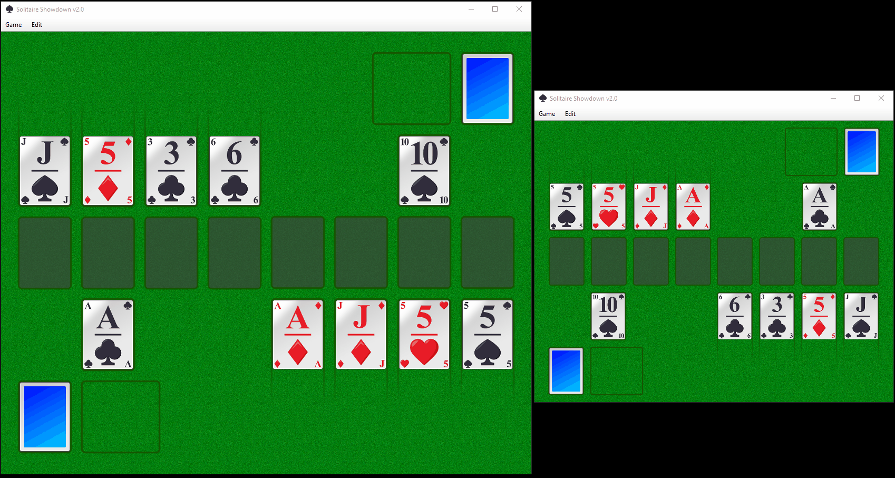

# cards2.0
A pluggable card game engine with support for a remake of MSN Messenger's Solitaire Showdown

## Project Goal
Back in the early nillies people could play Solitaire Showdown, a game included in the chat application MSN Messenger - later renamed to Windows Live Messenger. As Microsoft pulled the plug, this game is no longer available to the public, or at least not in its original form. 

This project's goal is to replicate the original as close as possible.

## A pluggable card game engine

The main engine found in cards_framework must be started with a plugin in order to run a game. Currently, two plugins are supported: 
* Solitaire (single player)
* Solitaire Showdown (1vs1 multiplayer)

## History

* Development started somewhere in october 2018 and was initially focused at making a standard, single player Solitaire game in order to have most of the UI stuff working. 
* Starting late 2018, netcode was added, after which the work on the actual game, Solitaire Showdown, was started. 
* After a long period of doing nothing, I continued somewhere around January 2020, refactoring the complete codebase and throwing away unnecessary garbage. When that was done, support for undoing command chains was added. (In multiplayer the server may not accept commands that are already executed client-side. They are executed client-side and corrected afterwards if necessary, to ensure a smooth gameplay that never blocks).
* The hardest part was then done. Support for lobbies was added, I completed the game logic, it all started coming together around April 2020. (see  - you see 2 players each having their own game instance running, being connected to a LAN server that one of the players is currently hosting).

The same card game engine can be used to drive a different card game, e.g. single player solitaire ([screenshot](screenshots/solitaire_590x445.png)).

## Sprites

All in-game sprites were made by me. For example, all cards were made in Paint.NET, using a bunch of layers to switch between red and black colored card elements, to switch the card value, to add a gloss etc. Then, I saved 52 times to a PNG file, each time with different layers switched on and off, resulting in 52 cards in PNG format. Infact, this was the first thing done before writing any code.

