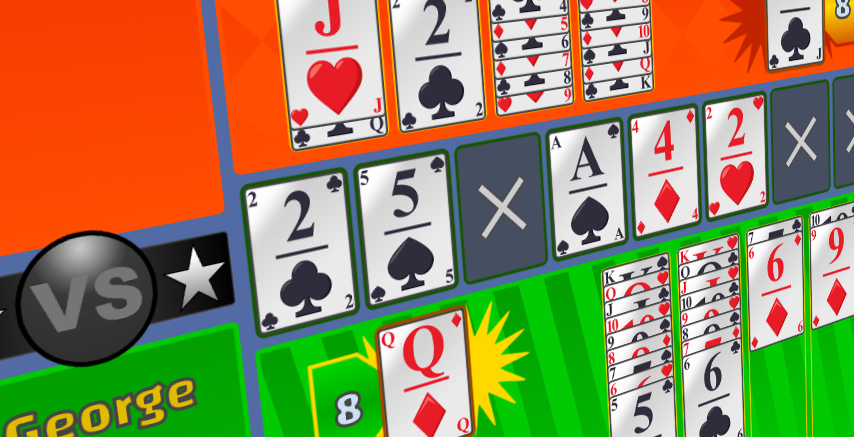
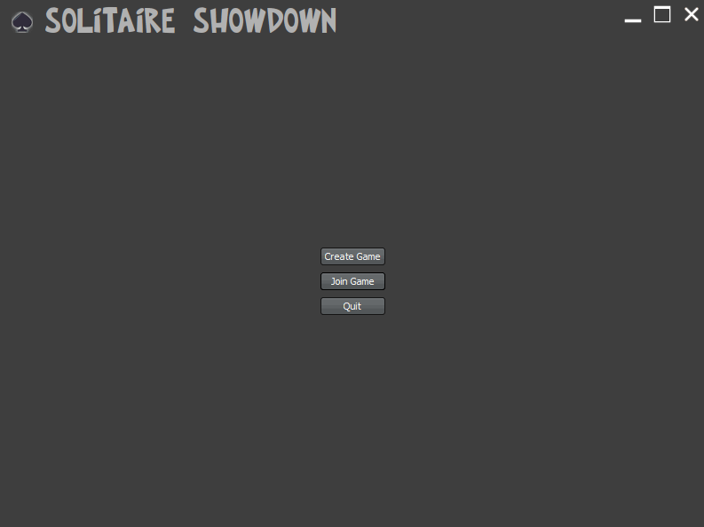

# cards2.0
A pluggable card game engine created by Tim De Mey coming with a plugin supporting a remake of MSN Messenger's Solitaire Showdown

## Project Goal
Back in the early nillies people could play Solitaire Showdown, a game included in the chat application MSN Messenger - later renamed to Windows Live Messenger. As Microsoft pulled the plug, this game is no longer available to the public, or at least not in its original form. 

This project's goal is to replicate the original as close as possible. [This](screenshots/solshow_orig_game.jpg?raw=true) is a screenshot of the original game.

The game is still unfinished as specific required parts are not yet (fully) developed. Some examples:
* Score system
* Sounds
* UI must be reworked to resemble the original game

## A pluggable card game engine

The main engine found in [cards_framework](../master/cards_framework) must be started with a [plugin](../master/cards_framework/src/main/java/src/gent/timdemey/cards/ICardPlugin.java) in order to run a game. Currently, two plugins are supported: 
* Solitaire (single player - [screenshot](screenshots/solitaire_590x445.png?raw=true) - [plugin](../master/cards_solitaire/src/main/java/src/gent/timdemey/cards/SolitairePlugin.java))
* Solitaire Showdown (1vs1 multiplayer - [animated GIF](screenshots/solitaireshowdown_11252020.gif?raw=true) - [plugin](../master/cards_solitaireshowdown/src/main/java/src/gent/timdemey/cards/SolShowPlugin.java))

## Latest animated GIF

## Project History
Go to [History](readme/history.md).

## Change logs
Go to [Changelogs](readme/changelogs.md).

## Downloads
Below are the standalone, executable JAR files that include all dependencies, except for Java itself. These are still beta (DEV) files and no official releases.
* [cards_solitaire-1.0.jar](https://github.com/T1mmos/cards2.0/raw/dev/downloads/cards_solitaire-1.0.jar)
* [cards_solitaireshowdown-1.0.jar](https://github.com/T1mmos/cards2.0/raw/dev/downloads/cards_solitaireshowdown-1.0.jar)